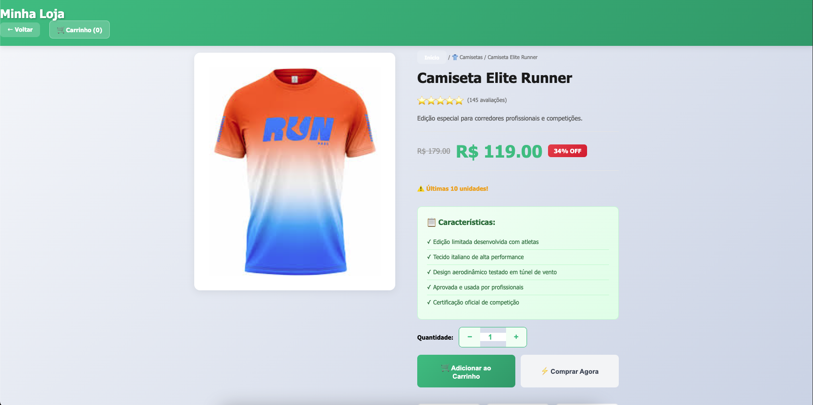
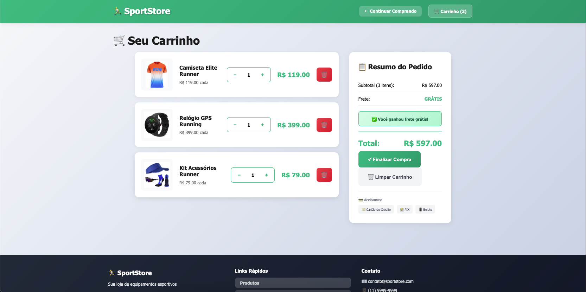
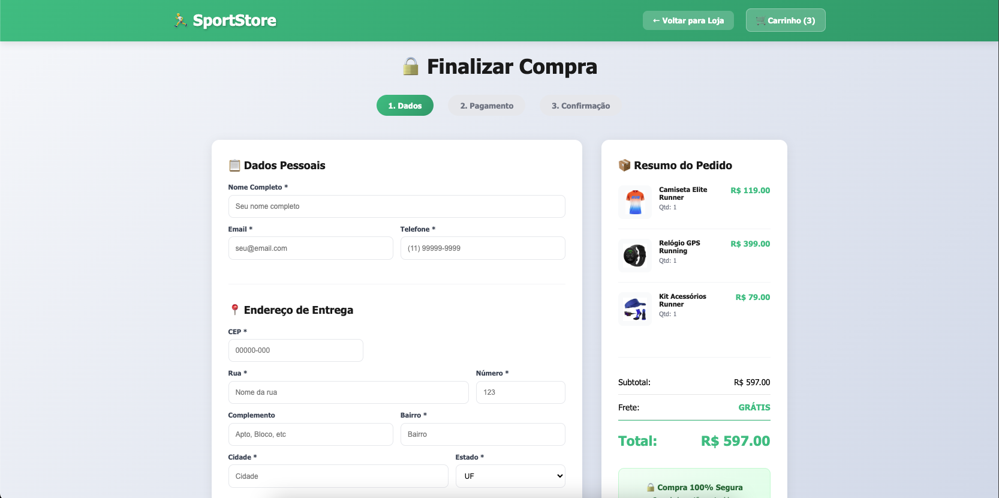
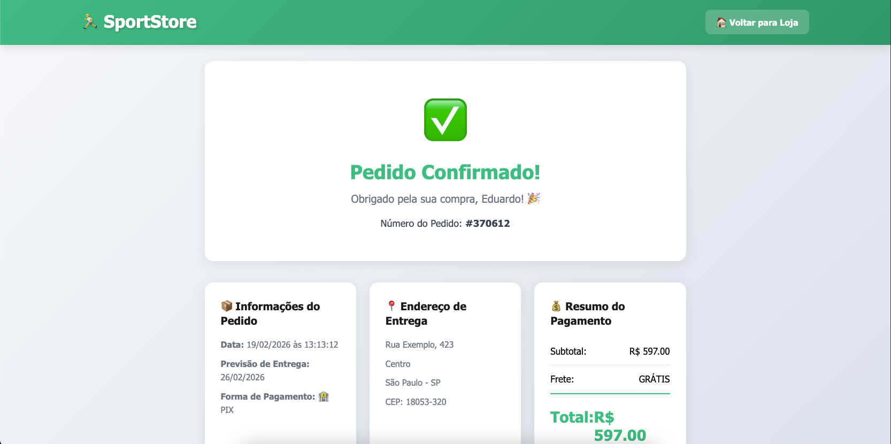

# 🏃 SportStore - E-commerce Completo

<div align="center">
  


**E-commerce completo de produtos esportivos desenvolvido com HTML, CSS e JavaScript puro**

[Ver Demo](#) • [Reportar Bug](#) • [Solicitar Feature](#)

</div>

---

## 📋 Sobre o Projeto

SportStore é um e-commerce completo e funcional desenvolvido do zero utilizando apenas HTML5, CSS3 e JavaScript puro (Vanilla JS). O projeto simula uma loja online real com carrinho de compras, sistema de pagamento, e gerenciamento de estoque.

### 🎯 Objetivo

Este projeto foi desenvolvido como parte do meu aprendizado em **Desenvolvimento Web Full-Stack**, com foco em:
- ✅ Fundamentos de HTML semântico
- ✅ CSS moderno (Grid, Flexbox, Animations)
- ✅ JavaScript ES6+ (Arrow Functions, Destructuring, LocalStorage)
- ✅ Manipulação do DOM
- ✅ Responsividade Mobile-First
- ✅ UX/UI Design

---

## ✨ Funcionalidades

### 🛍️ Catálogo de Produtos
- [x] 20 produtos organizados em 4 categorias
- [x] Filtro por categoria (Tênis, Camisetas, Shorts, Acessórios)
- [x] Sistema de busca e navegação
- [x] Cards com animações hover

### 🛒 Carrinho de Compras
- [x] Adicionar/remover produtos
- [x] Atualizar quantidade
- [x] Cálculo automático de subtotal
- [x] Frete grátis acima de R$ 199
- [x] Persistência de dados (LocalStorage)

### 💳 Sistema de Pagamento
- [x] Formulário completo de checkout
- [x] 3 formas de pagamento:
  - Cartão de Crédito (com parcelamento)
  - PIX (com QR Code simulado)
  - Boleto Bancário
- [x] Validação de campos
- [x] Máscaras de entrada (CEP, telefone, cartão)

### 📦 Gestão de Pedidos
- [x] Confirmação de compra
- [x] Número de pedido único
- [x] Resumo completo da compra
- [x] Informações de entrega

### 📱 Responsividade
- [x] Design adaptativo para todos os dispositivos
- [x] Layout otimizado para mobile, tablet e desktop
- [x] Breakpoints estratégicos

---

## 🖼️ Screenshots

### Página Principal


### Detalhes do Produto


### Carrinho de Compras


### Checkout


### Confirmação do Pedido


---

## 🚀 Tecnologias Utilizadas

### Frontend
- **HTML5** - Estrutura semântica
- **CSS3** - Estilização e animações
  - CSS Grid & Flexbox
  - Media Queries
  - Animations & Transitions
- **JavaScript (ES6+)** - Lógica e interatividade
  - LocalStorage API
  - DOM Manipulation
  - Event Listeners
  - Arrow Functions
  - Destructuring

### Ferramentas
- Git & GitHub
- VS Code
- Chrome DevTools

---

## 📂 Estrutura do Projeto
```
sportstore/
├── index.html              # Página principal
├── produto.html            # Página de detalhes
├── carrinho.html           # Página do carrinho
├── checkout.html           # Página de pagamento
├── confirmacao.html        # Página de confirmação
├── style.css               # Estilos globais
├── script.js               # Lógica principal
├── produto.js              # Lógica da página de detalhes
├── carrinho.js             # Lógica do carrinho
├── checkout.js             # Lógica do checkout
├── imagens/                # Imagens dos produtos
    ├── tenis/
    ├── camisetas/
    ├── shorts/
    ├── acessorios/
    └──screenshots/            # Prints do projeto
```

---

## 💻 Como Rodar o Projeto

### Pré-requisitos
- Navegador web moderno (Chrome, Firefox, Edge, Safari)
- Editor de código (VS Code recomendado)

### Instalação

1. Clone o repositório
```bash
git clone https://github.com/seu-usuario/sportstore.git
```

2. Entre na pasta do projeto
```bash
cd sportstore
```

3. Abra o arquivo `index.html` no navegador
```bash
# Windows
start index.html

# Mac
open index.html

# Linux
xdg-open index.html
```

**Ou use a extensão Live Server do VS Code para desenvolvimento**

---

## 🎨 Paleta de Cores

| Cor               | Hex                                                                |
| ----------------- | ------------------------------------------------------------------ |
| Verde Principal   |  `#10B981` |
| Verde Escuro      |  `#059669` |
| Cinza Claro       |  `#F3F4F6` |
| Cinza Escuro      |  `#1F2937` |
| Vermelho          |  `#EF4444` |

---

## 📚 O que Aprendi

Durante o desenvolvimento deste projeto, aprofundei meus conhecimentos em:

### JavaScript
- Manipulação avançada do DOM
- Gerenciamento de estado com LocalStorage
- Event Delegation
- Funções de ordem superior (map, filter, reduce, forEach)
- Arrow Functions e Template Literals

### CSS
- CSS Grid para layouts complexos
- Flexbox para alinhamento
- Animações e transições suaves
- Media Queries para responsividade
- Variáveis CSS (Custom Properties)

### Boas Práticas
- Código limpo e organizado
- Comentários significativos
- Nomenclatura semântica
- Separação de responsabilidades

---

## 🔜 Próximas Melhorias

- [ ] Integração com backend (Node.js + Express)
- [ ] Banco de dados (PostgreSQL)
- [ ] Sistema de autenticação (login/registro)
- [ ] Área administrativa
- [ ] Integração real de pagamento (Stripe/Mercado Pago)
- [ ] Sistema de avaliações
- [ ] Wishlist (lista de desejos)
- [ ] Histórico de pedidos
- [ ] Sistema de cupons de desconto

---

## 🤝 Contribuindo

Contribuições são bem-vindas! Sinta-se à vontade para:

1. Fazer um Fork do projeto
2. Criar uma Branch para sua feature (`git checkout -b feature/MinhaFeature`)
3. Commit suas mudanças (`git commit -m 'Adiciona MinhaFeature'`)
4. Push para a Branch (`git push origin feature/MinhaFeature`)
5. Abrir um Pull Request

---

## 📝 Licença

Este projeto está sob a licença MIT. Veja o arquivo [LICENSE](LICENSE) para mais detalhes.

---

## 👨‍💻 Autor

**Eduardo Braga**

- LinkedIn: [https://www.linkedin.com/in/eduardo-braga-a6a62b244/](#)
- GitHub: [@BragaDudu](#)
- Email: eduardob.ciqueira@gmail.com

---


<div align="center">
  
Feito com ❤️ e ☕ por Eduardo Braga

⭐ Se este projeto te ajudou, considere dar uma estrela!

</div>
```

---
